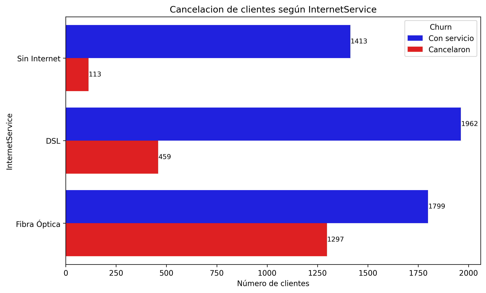
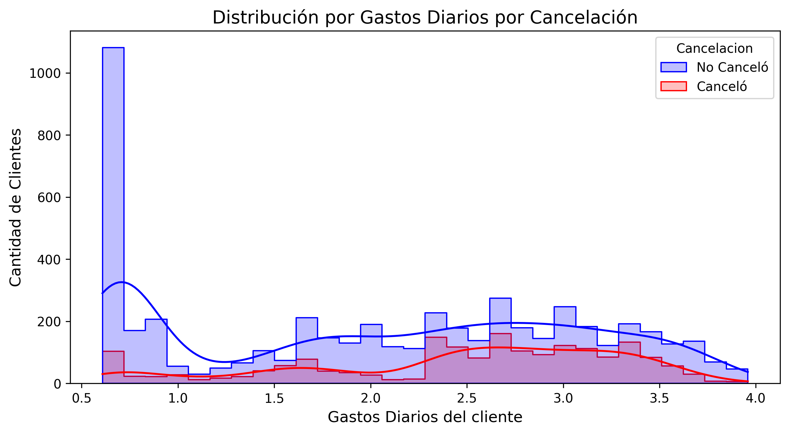
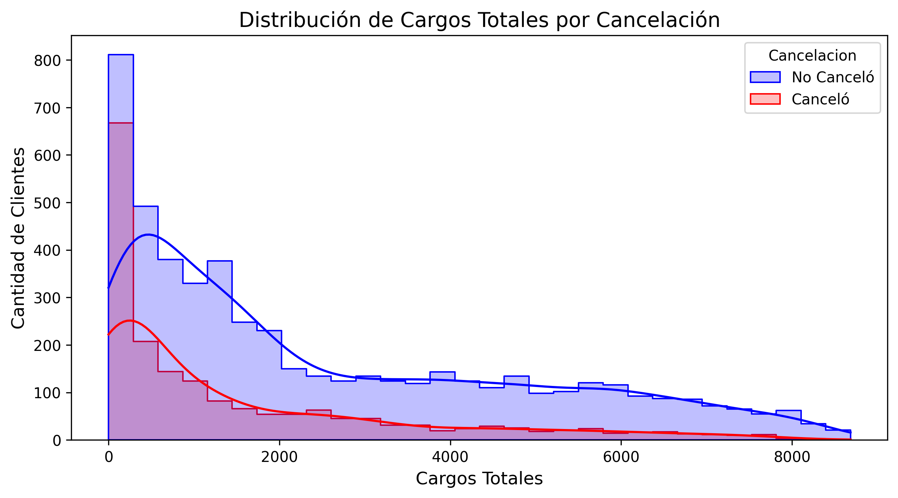
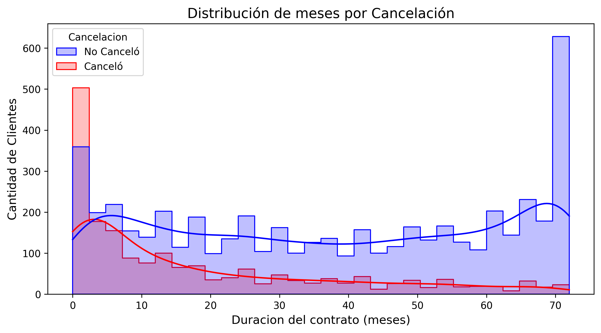
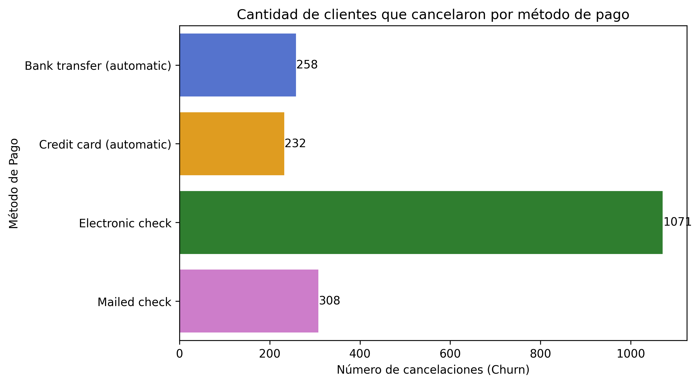
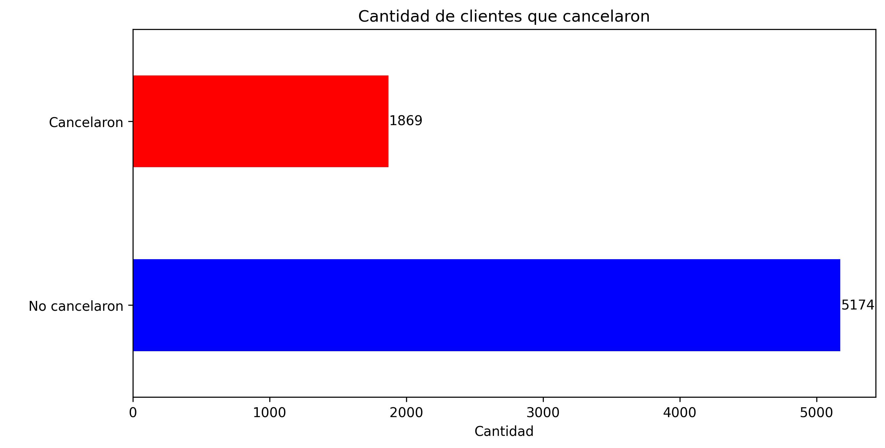
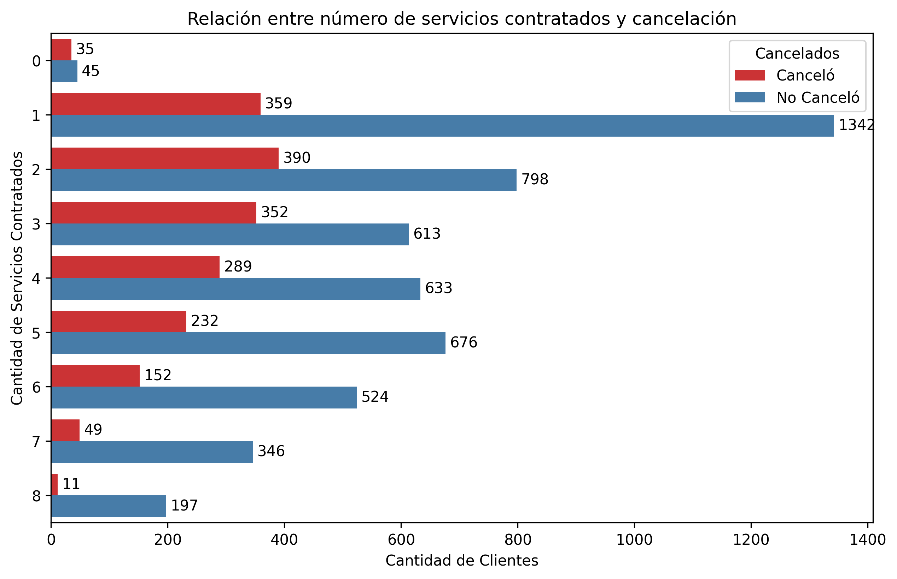

# TelecomX_LATAM_challenge2-data-science-LATAM

Telecom X - Análisis de Evasión de Clientes

"Has sido contratado como asistente de análisis de datos en Telecom X y formarás parte del proyecto "Churn de Clientes". La empresa enfrenta una alta tasa de cancelaciones y necesita comprender los factores que llevan a la pérdida de clientes.
Tu desafío será recopilar, procesar y analizar los datos, utilizando Python y sus principales bibliotecas para extraer información valiosa. A partir de tu análisis, el equipo de Data Science podrá avanzar en modelos predictivos y desarrollar estrategias para reducir la evasión."

# 📊 Análisis de Cancelaciones de Clientes - TelecomX

Este es un proyecto propuesto por Alura, sobre el análisis una muestra de datos, esto con el fin de  identificar las principales causas de cancelación de clientes en una empresa de telecomunicaciones. Se trabajó con un conjunto de datos público que simula la información de clientes, servicios contratados, métodos de pago y comportamiento de permanencia. Este se obtuvo por medio de un JSON. 

## 📌 Objetivo

A partir de columnas clave como tipo de contrato, servicios contratados, tipo de internet, método de pago y tiempo de permanencia, se buscó detectar los factores más influyentes en la decisión de cancelar el servicio y proponer recomendaciones para reducir la tasa de cancelación.

---

## 🧪 Análisis Incluido

✅ Distribución de cancelaciones totales  
✅ Cancelaciones por género  
✅ Cancelaciones según tipo de internet  
✅ Cancelaciones por tipo de contrato  
✅ Cancelaciones por método de pago  
✅ Análisis de tiempo de permanencia (tenure)  
✅ Relación entre cantidad de servicios contratados y cancelación  
✅ Relación entre tipo de internet y contrato

### 📈 Gráficos

| .png "📈 Contratos") |  |  |
|:------------------------------------------------------:|:------------------------------------------------------:|:--------------------------------------------------------------|
|  |  |  |
|  |  | .png "🌐 Relación") |
|  |  |  |

---

## 📂 Estructura del Proyecto
```plaintext
/
├──/data/
    └── TelecomX_Data.json
├── TelecomX_LATAM.ipynb          # 📓 Notebook de Jupyter donde se realizo el análisis, gráficas y conclusiones.
├── README.md                     # 📖 Explicación del proyecto, contexto, objetivos, metodología, resultados clave.
└── Imagenes/                     # 📂 Carpeta con todas las gráficas y visualizaciones exportadas desde el notebook.
    ├── Contract (1).png
    ├── InternetService.png
    ├── cancelacion_porDias_gastos.png
    ├── cancelacion_por_cargos.png
    ├── cancelacion_por_meses (1).png
    ├── cancelacion_por_meses.png
    ├── cancelaciones_por_metodo.png
    ├── distribucion_cancelacion.png
    ├── gender.png
    ├── relacion_internet_contract_churn (1).png
    └── servicios_contratados_cancelados.png

```
---

## 📈 Insights Obtenidos

🔍 1. Percepción de Precio Alto vs. Competencia  

🔍 2. Contrato "Mes a Mes" = Mayor Predictor de Churn

🔍 3. "Electronic Check": Método de Pago Más Riesgoso  

🔍 4. Primeros 60 Días: Ventana Crítica  

🔍 5. Servicios Complementarios: Arma de Doble Filo

---


## 🧾 Conclusión del Estudio

Con base en los datos analizados se concluye que:

- Los contratos mes a mes, especialmente con Fibra Óptica, requieren estrategias de fidelización más sólidas.
- Se deben crear campañas de retención para clientes en sus primeros 2 meses.
- Es recomendable incentivar métodos de pago automáticos y paquetes de servicios múltiples.
- Dentro del trabajo se dieron recomendaciones a seguir con el objetivo que el equipo de Data pueda seguir con el analisis.  

---

## 🚀 Cómo Ejecutar el Notebook en Google Colab

Puedes abrir y ejecutar el análisis fácilmente desde Google Colab:

👉 [Abrir TelecomX_LATAM.ipynb](https://github.com/Elavat9000/TelecomX_LATAM_challenge2-data-science-LATAM/blob/main/TelecomX_LATAM.ipynb)

**Pasos:**
1. Haz clic en el enlace de arriba.
2. Haz clic en "Open in colab"
3. Inicia sesión con tu cuenta de Google (si no lo has hecho).
4. Ejecuta las celdas del notebook (una por una o con “Ejecutar todo Ctrl+F9”).
5. El dataset se carga desde una URL pública en GitHub, por lo que no necesitas subir nada.

---
## 🛠️ Tecnologías Usadas

- Python
- Pandas
- NumPy
- Matplotlib
- Seaborn
- Google Colab
- Markdown

---

**📌 Autor:** Francisco  Javier Cervantes Mendieta  
**📅 Fecha:** 08 Junio 2025  
